# SteelPlant Maintenance Wizard

**AI Maintenance Command Center for Steel Manufacturing** — combining predictive analytics, anomaly detection, RAG knowledge retrieval, multi-agent reasoning, real-time alerting, and explainable maintenance recommendations.

Built for **Tata Steel AI Hackathon 2026 (Round 2)**.

| | |
|---|---|
| **Live Demo** | [steelplant-maintenance-wizard.vercel.app](https://steelplant-maintenance-wizard.vercel.app) |
| **API Docs** | [steelplant-maintenance-wizard.onrender.com/docs](https://steelplant-maintenance-wizard.onrender.com/docs) |
| **Repository** | [github.com/Divyanshu0230/steelplant-maintenance-wizard](https://github.com/Divyanshu0230/steelplant-maintenance-wizard) |

---

## Table of Contents

1. [What This System Does](#what-this-system-does)
2. [System Architecture](#system-architecture)
3. [Technology Stack](#technology-stack)
4. [Data Flow & System Flow](#data-flow--system-flow)
5. [Model Design & Reasoning Pipeline](#model-design--reasoning-pipeline)
6. [Alerting & Prediction Logic](#alerting--prediction-logic)
7. [Assumptions & Limitations](#assumptions--limitations)
8. [Install, Configure & Run](#install-configure--run)
9. [Sample Input & Output](#sample-input--output)
10. [Project Structure](#project-structure)
11. [API Reference](#api-reference)
12. [Deployment](#deployment)
13. [Further Documentation](#further-documentation)

---

## What This System Does

Steel plants operate complex, interdependent equipment. Maintenance teams rely on fragmented manuals, SOPs, sensor logs, and expert judgment — making diagnosis slow and inconsistent.

**SteelPlant Maintenance Wizard** consolidates this into one intelligent platform:

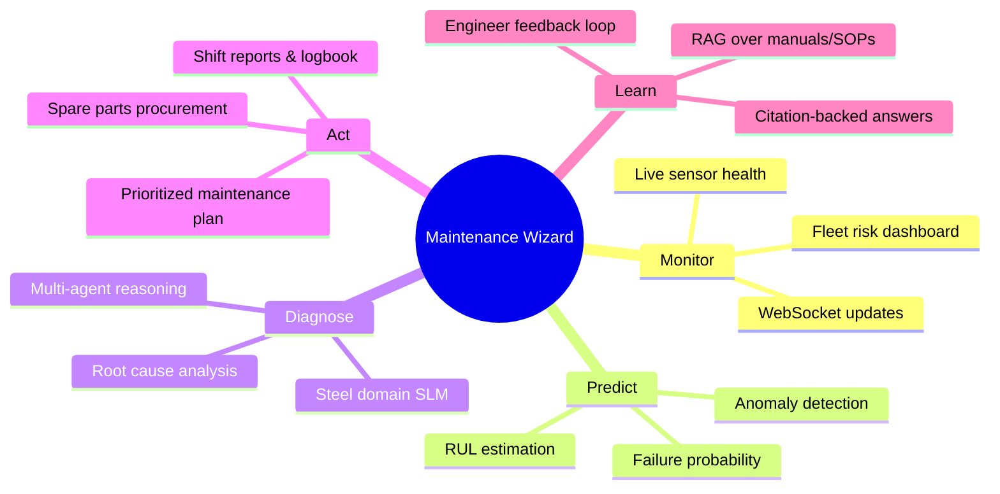

| Capability | Description |
|------------|-------------|
| **Predictive Maintenance** | RUL cycles, failure probability, degradation scoring per asset |
| **Anomaly Detection** | Isolation Forest + ISO 10816 vibration thresholds |
| **AI Diagnosis** | Structured RCA with confidence scores and evidence chains |
| **Knowledge Engine** | Hybrid RAG search over manuals, SOPs, incident reports |
| **Real-Time Alerting** | Info → Warning → High → Critical severity levels |
| **Multi-Agent AI** | 8 specialized agents orchestrated via LangGraph |
| **Explainability** | Citations, agent trace, risk factors, data provenance |
| **Operations** | Logbook, spare parts, procurement, PDF shift reports |

---

## System Architecture

### High-Level Architecture

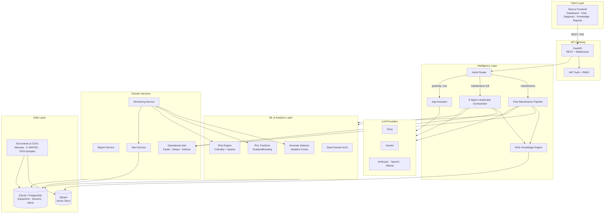

### Deployment Topology

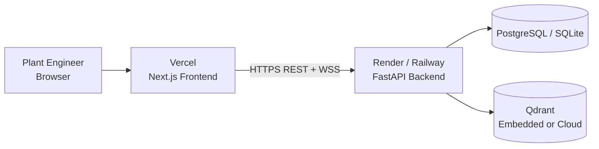

### Frontend Application Map

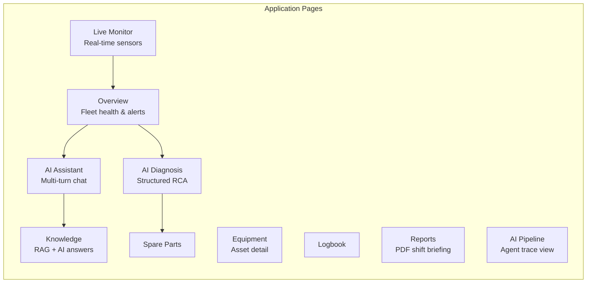

---

## Technology Stack

| Layer | Technology | Purpose |
|-------|------------|---------|
| **Frontend** | Next.js 14, TypeScript, Tailwind CSS | Dashboard, chat UI, live monitoring |
| **Charts / Viz** | Recharts, Three.js (plant 3D) | Health charts, vibration spectrum, plant map |
| **Backend** | FastAPI, Python 3.12, Uvicorn | REST API, WebSocket, agent orchestration |
| **AI Orchestration** | LangGraph, LangChain | Multi-agent workflow routing |
| **LLM** | Groq (primary), Gemini, Anthropic, OpenAI, Ollama | Natural language reasoning with auto-fallback |
| **Embeddings** | BAAI/bge-small-en-v1.5 | Document and query vectorization |
| **Vector DB** | Qdrant (embedded local / cloud) | Semantic search over manuals & SOPs |
| **ML — Anomaly** | Isolation Forest, scikit-learn | Sensor abnormality detection |
| **ML — Prediction** | GradientBoosting, XGBoost | RUL and failure probability |
| **ML — Domain** | Steel Domain SLM (pattern layer) | Steel-specific fault pattern matching |
| **Database** | SQLite (dev), PostgreSQL (prod) | Equipment, sensors, alerts, conversations |
| **Auth** | JWT + Role-Based Access Control | Engineer / Supervisor / Admin roles |
| **Reports** | ReportLab / structured JSON | Shift briefing and maintenance PDFs |
| **Deploy** | Vercel + Render (+ Docker/Railway option) | Production hosting |

---

## Data Flow & System Flow

### End-to-End Data Flow

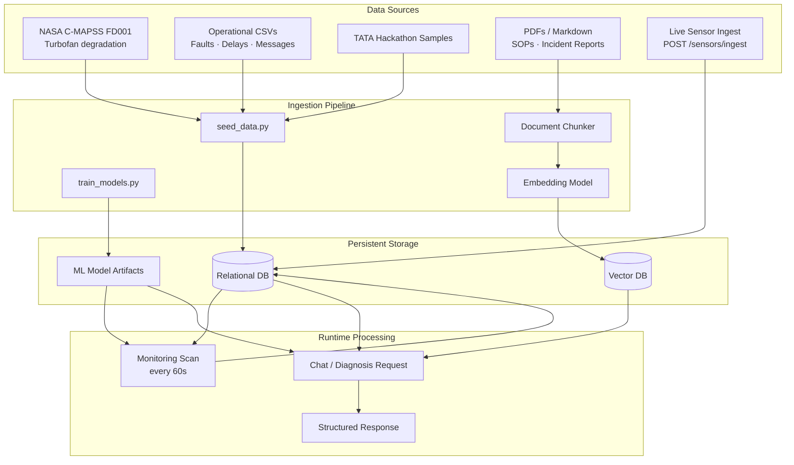

### User Request Flow (Chat / Diagnosis)

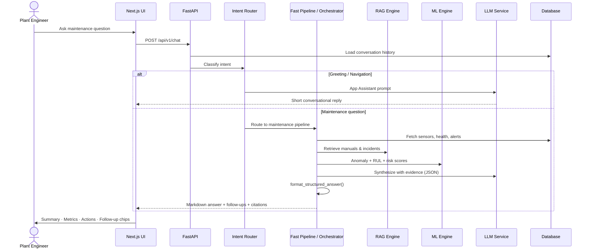

### Background Monitoring Flow

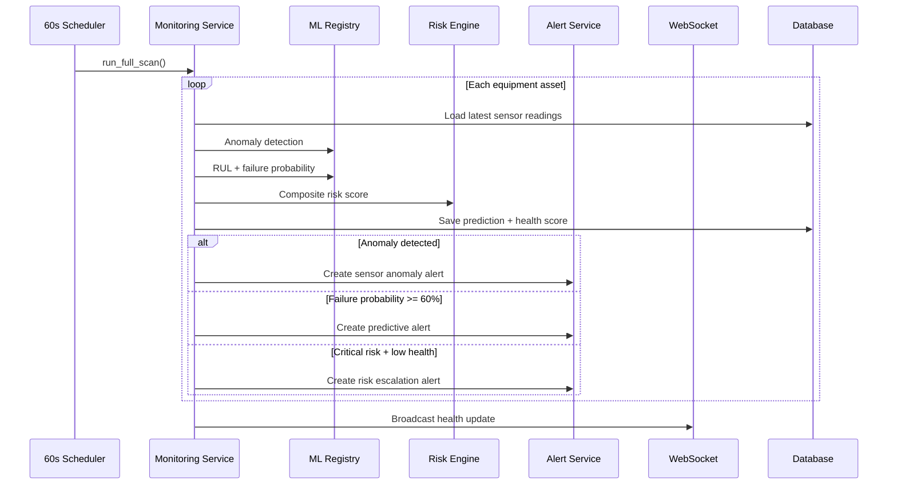

---

## Model Design & Reasoning Pipeline

### ML Model Design

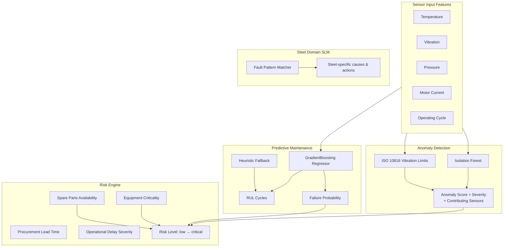

| Model | Algorithm | Input | Output |
|-------|-----------|-------|--------|
| **Anomaly Detector** | Isolation Forest + thresholds | 5 sensor features | `is_anomaly`, severity, contributing sensors |
| **RUL Predictor** | GradientBoosting (C-MAPSS trained) | Sensor matrix + cycle count | `rul_cycles`, `failure_probability` |
| **Risk Engine** | Weighted rule engine | ML outputs + criticality + spares | `risk_level`, `health_score` |
| **Steel Domain SLM** | Pattern-matching expert layer | Query + sensor profile | Steel fault patterns, domain actions |
| **RAG Retriever** | Hybrid dense + keyword search | User query | Manual excerpts with relevance score |

### AI Reasoning Pipeline

Two modes are available (controlled by `ENABLE_FULL_AGENTIC`):

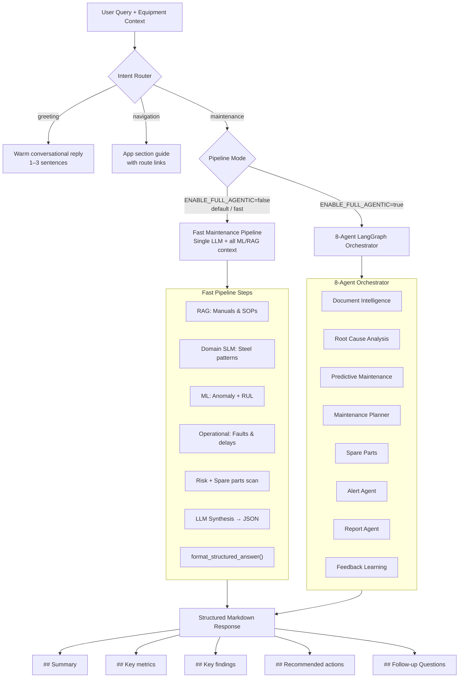

### Multi-Agent Responsibilities

| Agent | Role |
|-------|------|
| **Document Intelligence** | Retrieve manuals, SOPs, incident reports via RAG |
| **Root Cause Analysis** | Analyze symptoms, rank probable causes with confidence |
| **Predictive Maintenance** | Attach RUL, failure probability, degradation context |
| **Maintenance Planner** | Prioritize actions by timeframe and criticality |
| **Spare Parts** | Match inventory, lead times, procurement recommendations |
| **Alert** | Generate and escalate severity-based notifications |
| **Report** | Structure shift briefings and downloadable reports |
| **Feedback Learning** | Inject engineer corrections into future prompts |

---

## Alerting & Prediction Logic

### Alert Generation Decision Tree

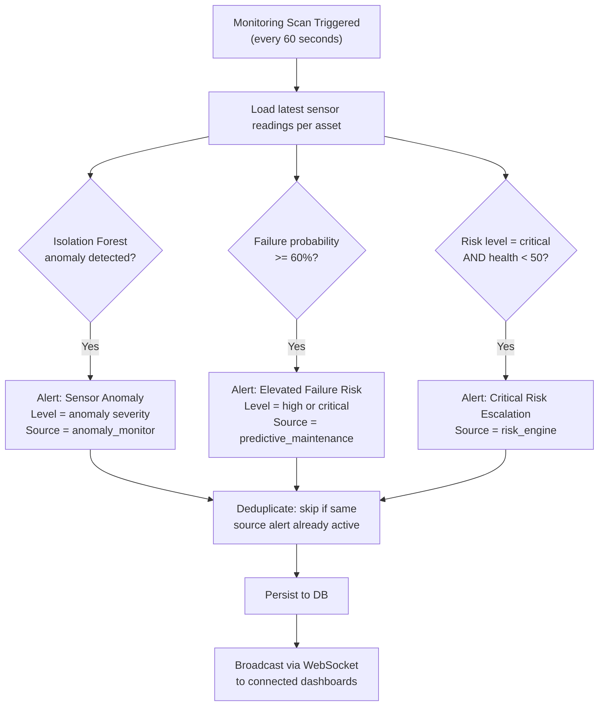

### Alert Severity Levels

| Level | Trigger Examples | User Impact |
|-------|------------------|-------------|
| **Info** | Minor sensor drift, informational scan events | Logged, visible in alert panel |
| **Warning** | Moderate anomaly, degradation trend | Highlighted on dashboard |
| **High** | Failure probability 60–84%, significant vibration | Requires acknowledgment |
| **Critical** | Failure probability ≥ 85%, critical risk + low health | Immediate action recommended |

### Health Score Computation

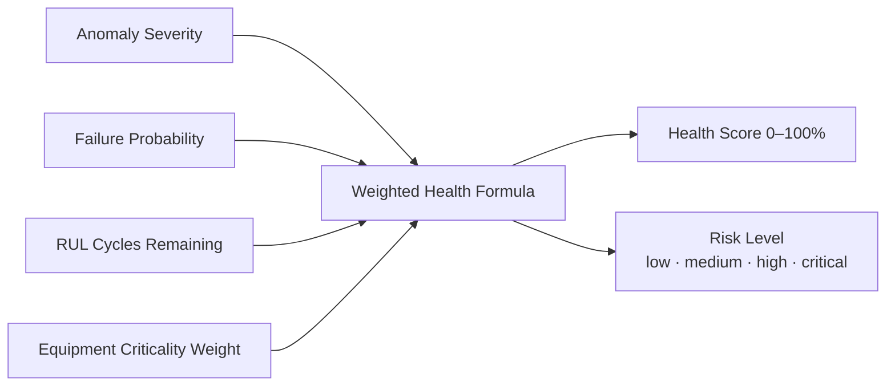

### Prediction Logic Summary

1. **Train** models on NASA C-MAPSS FD001 via `scripts/train_models.py`
2. **Map** turbofan degradation patterns to steel plant equipment codes (RM-MOTOR-03, BF-BLOWER-01, etc.)
3. **Scan** all equipment every 60 seconds in `MonitoringService.run_full_scan()`
4. **Persist** predictions and health scores to the database
5. **Generate** alerts only when thresholds are crossed and no duplicate active alert exists
6. **Broadcast** updated health to the dashboard via WebSocket

---

## Assumptions & Limitations

### Assumptions

| Assumption | Rationale |
|------------|-----------|
| C-MAPSS turbofan data represents steel equipment degradation | No live Tata SCADA connection in hackathon; industry-standard public dataset |
| Sensor readings are cycle-based time series | Matches C-MAPSS structure and monitoring scan design |
| At least one LLM API key is configured | Groq free tier recommended; offline fallback available for demo |
| Equipment catalog is pre-seeded | 5 asset types with mapped locations, criticality, and spare parts |
| Documents in `data/documents/` are authoritative | Manuals, SOPs, and incident reports for RAG retrieval |

### Limitations

| Limitation | Current State | Production Path |
|------------|---------------|-----------------|
| No live plant SCADA/PLC integration | CSV + API ingest only | `POST /api/v1/sensors/ingest` ready for real feeds |
| SQLite on ephemeral cloud disk | Data resets on container rebuild (free tier) | PostgreSQL + persistent disk |
| Full 8-agent mode is slower | `ENABLE_FULL_AGENTIC=false` uses fast pipeline | Upgrade server RAM / use Standard tier |
| ML fallback heuristics without trained artifacts | `train_models.py` required for best accuracy | Run training in CI/CD build step |
| Domain SLM is pattern-based, not fine-tuned | Prompt + rule layer, not a trained SLM | `train_domain_adapter.py` scaffold exists |
| Render free tier cold starts | 30–120s delay after idle | Standard plan or Railway always-on |

> **For judges:** Live Tata SCADA is not connected (consistent with reference hackathon submissions). The platform is architected for real ingest without code changes. See [Hackathon Alignment](docs/data-sources/HACKATHON_ALIGNMENT.md) for requirement-by-requirement mapping.

---

## Install, Configure & Run

### Prerequisites

- **Python** 3.11+ (3.12 recommended)
- **Node.js** 18+
- At least one **LLM API key** (Groq recommended — free tier)

### Step 1 — Clone & Backend Setup

```bash
git clone https://github.com/Divyanshu0230/steelplant-maintenance-wizard.git
cd steelplant-maintenance-wizard

cd backend
python -m venv venv
source venv/bin/activate        # Windows: venv\Scripts\activate
pip install -r requirements.txt
```

### Step 2 — Environment Configuration

```bash
cp .env.example .env
```

| Variable | Required | Description |
|----------|----------|-------------|
| `GROQ_API_KEY` | Recommended | Primary LLM — [console.groq.com](https://console.groq.com/keys) |
| `GEMINI_API_KEY` | Optional | Fallback LLM |
| `LLM_FALLBACK_ORDER` | Optional | Default: `groq,gemini,anthropic,openai,xai,ollama` |
| `ENABLE_FULL_AGENTIC` | Optional | `false` = fast pipeline (recommended for demo) |
| `DATABASE_URL` | Optional | SQLite default; PostgreSQL for production |
| `SECRET_KEY` | Production | JWT signing key — use a fixed value in production |
| `CORS_ORIGINS` | Production | e.g. `https://your-app.vercel.app,http://localhost:3000` |

Verify LLM connectivity:

```bash
python scripts/verify_llm.py
```

### Step 3 — Seed Data & Train Models

```bash
cd ..
python scripts/seed_data.py      # Load equipment, sensors, docs, operational CSVs
python scripts/train_models.py   # Train anomaly + RUL models on C-MAPSS
```

### Step 4 — Start Backend

```bash
cd backend
uvicorn app.main:app --reload --host 0.0.0.0 --port 8000
```

API documentation: **http://localhost:8000/docs**

### Step 5 — Start Frontend

```bash
cd frontend
npm install
npm run dev
```

Dashboard: **http://localhost:3000**

### Default Logins

| Role | Email | Password |
|------|-------|----------|
| Maintenance User | `engineer1@steelplant.com` | `password123` |
| Operations Lead | `supervisor1@steelplant.com` | `password123` |
| Plant Administrator | `admin1@steelplant.com` | `password123` |

### Running Tests

```bash
cd backend
pytest tests/ -v
```

---

## Sample Input & Output

### Example 1 — Maintenance Chat (API)

**Input:**

```bash
curl -X POST http://localhost:8000/api/v1/chat \
  -H "Content-Type: application/json" \
  -d '{
    "message": "What is causing the vibration spike on RM-MOTOR-03?",
    "equipment_code": "RM-MOTOR-03"
  }'
```

**Output (structured markdown in `answer` field):**

```markdown
## Summary
Assessment for **RM-MOTOR-03** based on live sensors, ML models, and plant manuals.
Elevated vibration aligns with bearing wear pattern from incident INC-2024-087.

## Key metrics
- **Failure probability:** 72%
- **Remaining useful life:** ~18 cycles
- **Risk level:** HIGH

## Key findings
- Bearing wear on drive end (85% confidence)
- Misalignment contributing factor (55% confidence)

## Recommended actions
1. Schedule bearing inspection — vibration analysis (ASAP)
2. Order replacement bearing BRG-RMM-450 (next shift)
3. Reduce load until inspection complete (immediate)

## Follow-up Questions
-> What spare parts should I order?
-> Is it safe to keep running?
-> Show me the relevant SOP section
```

**JSON response fields:**

```json
{
  "conversation_id": 1,
  "answer": "## Summary\n...",
  "risk_level": "high",
  "confidence_score": 0.85,
  "ai_mode": "groq",
  "intent": "maintenance",
  "agent_steps": [
    "Intent Router: Maintenance / follow-up detected",
    "Document Agent: RAG retrieval from manuals & SOPs",
    "Predictive Agent: Isolation Forest + RUL models",
    "Synthesizer: Agentic AI reasoning"
  ],
  "follow_up_suggestions": [
    "What spare parts should I order?",
    "Is it safe to keep running?",
    "Show me the relevant SOP section"
  ]
}
```

### Example 2 — Equipment Health Dashboard

**Input:**

```bash
curl http://localhost:8000/api/v1/equipment/health
```

**Output:**

```json
[
  {
    "equipment_id": 3,
    "equipment_code": "RM-MOTOR-03",
    "equipment_name": "Roughing Mill Motor 03",
    "health_score": 42.5,
    "risk_level": "critical",
    "rul_cycles": 18
  }
]
```

### Example 3 — Diagnosis Scenario (UI)

| Step | Action | Expected Output |
|------|--------|-----------------|
| 1 | Login as `engineer1@steelplant.com` | Dashboard loads with fleet health chart |
| 2 | Navigate to **AI Diagnosis** | Select equipment `RM-MOTOR-03` |
| 3 | Click scenario *"High vibration detected"* | Agent trace shows pipeline steps |
| 4 | View result | Summary, causes with %, actions, spare parts, citations |
| 5 | Download PDF report | Shift briefing with risk assessment |

### Example 4 — Knowledge Search

**Input:**

```bash
curl -X POST http://localhost:8000/api/v1/knowledge/search \
  -H "Content-Type: application/json" \
  -d '{"query": "blower bearing replacement procedure"}'
```

**Output:** Ranked manual excerpts with source document, relevance score, and citation text for the Knowledge page and AI answer generation.

### Demo Walkthrough

See [docs/DEMO_SCRIPT.md](docs/DEMO_SCRIPT.md) for a full 5–7 minute judge demo script.

---

## Project Structure

```
steelplant-maintenance-wizard/
├── frontend/                  # Next.js application
│   └── src/
│       ├── app/               # Pages: dashboard, chat, diagnosis, knowledge…
│       ├── components/        # UI components (charts, panels, agent trace)
│       └── lib/               # API client, chat parsing, design tokens
├── backend/
│   └── app/
│       ├── agents/            # LangGraph orchestrator + fast pipeline
│       ├── api/routes/        # REST endpoints
│       ├── ml/                # Anomaly, RUL, risk, domain SLM
│       ├── rag/               # Knowledge engine + embeddings
│       ├── services/          # Monitoring, alerts, reports, LLM
│       └── models/            # SQLAlchemy entities + Pydantic schemas
├── data/
│   ├── documents/             # Manuals, SOPs, incident reports
│   ├── operational/           # Fault codes, delay logs, messages
│   └── tata-hackathon/        # Round 2 sample data
├── scripts/
│   ├── seed_data.py           # Database + vector store seeding
│   ├── train_models.py        # C-MAPSS model training
│   └── verify_llm.py          # LLM connectivity check
├── docs/                      # Detailed architecture & install guides
├── render.yaml                # Render deployment config
├── Dockerfile                 # Docker / Railway deployment
└── README.md                  # This file
```

---

## API Reference

| Method | Endpoint | Description |
|--------|----------|-------------|
| `POST` | `/api/v1/auth/login` | JWT authentication |
| `POST` | `/api/v1/chat` | Multi-turn maintenance assistant |
| `POST` | `/api/v1/diagnosis` | Structured equipment diagnosis |
| `GET` | `/api/v1/equipment/health` | Fleet health dashboard data |
| `GET` | `/api/v1/equipment` | Equipment catalog |
| `GET` | `/api/v1/alerts` | Active alerts |
| `POST` | `/api/v1/alerts/{id}/resolve` | Resolve alert with notes |
| `POST` | `/api/v1/knowledge/search` | RAG document search |
| `POST` | `/api/v1/knowledge/ask` | AI answer with citations |
| `POST` | `/api/v1/reports/generate` | Generate maintenance report |
| `POST` | `/api/v1/feedback` | Submit engineer feedback |
| `POST` | `/api/v1/sensors/ingest` | Real-time sensor ingestion |
| `GET` | `/api/v1/monitoring/status` | ML scan status |
| `WS` | `/api/v1/ws/monitoring` | Live health broadcast |

Full interactive docs: **http://localhost:8000/docs**

---

## Deployment

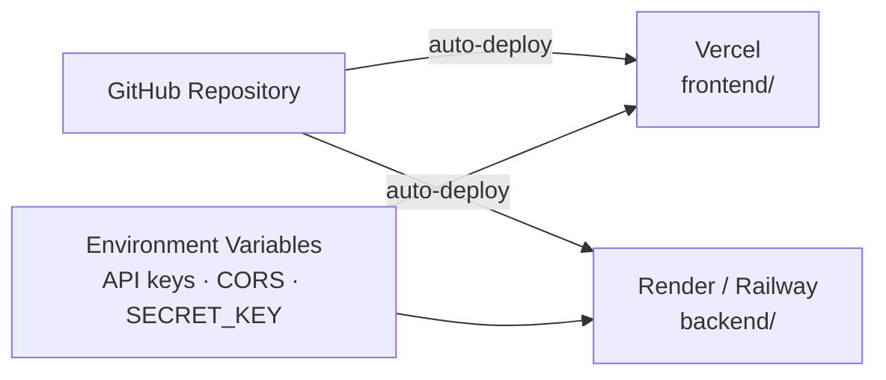

| Component | Platform | Config |
|-----------|----------|--------|
| **Frontend** | [Vercel](https://vercel.com) | Root: `frontend/` · Set `NEXT_PUBLIC_API_URL` |
| **Backend** | [Render](https://render.com) | See `render.yaml` · Python 3.12.8 |
| **Backend (alt)** | Railway / Docker | See `Dockerfile` + `railway.toml` |

**Production environment variables (backend):**

```
GROQ_API_KEY=...
CORS_ORIGINS=https://your-app.vercel.app
ENABLE_FULL_AGENTIC=false
SECRET_KEY=<fixed-random-string>
PYTHON_VERSION=3.12.8
```

**Will updating only README redeploy the app?**

- Pushing README changes to GitHub **does not change how the app runs**.
- Vercel/Render may trigger an auto-deploy on push, but it is harmless — only documentation changed.
- **No action needed** on Render or Vercel when updating README alone.

---

## Further Documentation

| Document | Contents |
|----------|----------|
| [Architecture](docs/ARCHITECTURE.md) | Detailed system design and agent descriptions |
| [System Design](docs/SYSTEM_DESIGN.md) | Reasoning pipeline, assumptions, limitations |
| [Installation Guide](docs/INSTALLATION.md) | Full install, env vars, deployment steps |
| [Demo Script](docs/DEMO_SCRIPT.md) | 5–7 minute walkthrough for judges |
| [Hackathon Alignment](docs/data-sources/HACKATHON_ALIGNMENT.md) | Requirement-by-requirement checklist |
| [Data Provenance](docs/data-sources/WHERE_DATA_COMES_FROM.md) | Where every dataset comes from |
| [Submission Checklist](docs/SUBMISSION_CHECKLIST.md) | Pre-submission verification |
| [Database Schema](backend/app/db/schema.sql) | Full SQL schema |

---

## License

Built for **Tata Steel AI Hackathon 2026**. All rights reserved by the respective authors and Tata Steel.
